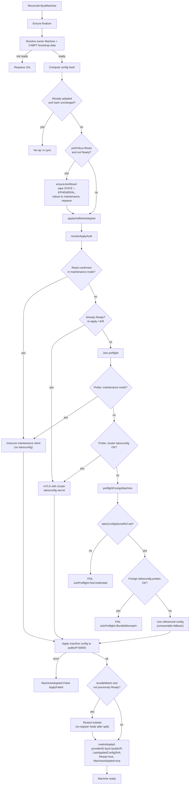

# cluster-api-provider-bringyourowntalos (byot)

Cluster API infrastructure provider that **adopts** existing Talos Linux
machines, identified by public IP, and applies the cluster's bootstrap machine
configuration over the Talos machine API.

Two adoption modes:

- **Maintenance mode**: machine waiting for configuration applies via
  unverified TLS (no host agent needed).
- **Already configured**: foreign machines previously booted with some other
  machineconfig are taken over via mTLS using the machine's *current*
  talosconfig (`spec.talosConfigSecretRef`).

After adoption, byot keeps machines in sync: when the bootstrap data changes,
the new configuration is re-applied using the cluster's own talosconfig.

Inspired by
[BYOH](https://github.com/vmware-tanzu/cluster-api-provider-bringyourownhost)
(unmaintained), without a host agent: Talos already exposes everything needed.

Design decisions: see [docs/PRD.md](docs/PRD.md).

## Usage

This provider is a library module: its controllers run in-process inside
[Kommodity](https://github.com/kommodity-io/kommodity). Enable it with
`KOMMODITY_INFRASTRUCTURE_PROVIDERS` including `byot`.

```yaml
apiVersion: infrastructure.cluster.x-k8s.io/v1alpha1
kind: ByotMachine
metadata:
  name: worker-0
spec:
  publicIP: "203.0.113.10"
  # Only for machines already configured elsewhere (foreign takeover):
  # talosConfigSecretRef:
  #   name: old-cluster-talosconfig
```

The controller:

1. Waits for the owning CAPI `Machine`'s bootstrap secret (generated by the
   Talos bootstrap provider, CABPT).
2. Runs the join preflight: the machine is probed to determine whether it is
   in maintenance mode, already carries this cluster's PKI bundle, or carries
   a foreign bundle (in which case adoption fails with
   `JoinPreflight=False/BundleMismatch` instead of silently misconfiguring the
   machine; set `spec.joinPolicy: Reset` to wipe it first).
3. Applies the machine configuration to `spec.publicIP:50000`:
   - machine in maintenance mode → unverified maintenance client
   - machine carrying this cluster's bundle → mTLS with the cluster's own
     `<cluster>-talosconfig` secret
   - later reconciles (config drift / upgrades) → mTLS with the cluster's own
     `<cluster>-talosconfig` secret
4. Sets `providerID` to `byot://<publicIP>`, records
   `status.lastAppliedConfigSHA`, and reports ready.

Disk encryption (network KMS against Kommodity) is configured in the Talos
machine configuration templates themselves; byot applies the configuration
untouched.

### Join / split policies

- **`spec.joinPolicy`** (`None` default, or `Reset`): with `None`, a machine
  carrying foreign cluster state fails the join preflight instead of being
  wiped (PLA-6479). With `Reset`, the machine is wiped (STATE + EPHEMERAL,
  reboot to maintenance) before configuration is applied. Auth uses
  `spec.talosConfigSecretRef`; on failure adoption is blocked. Join=Reset is a
  pre-adoption latch: once adopted it has no effect.
- **`spec.splitPolicy`** (`None` default, or `Reset`): with `None`, deleting a
  `ByotMachine` only removes it from management without touching the host;
  the machine keeps its configuration and datastore intact and can be
  re-adopted without changes. (The node still leaves the cluster roster:
  Cluster API's own Machine deletion flow drains and deletes the
  workload-cluster Node before the infra resource is released.) With `Reset`,
  deletion additionally wipes the machine (STATE + EPHEMERAL) and releases
  the finalizer only after the reset succeeds.

## Adoption flow



## Development

```sh
make generate  # deepcopy + CRDs
make build
make lint
make test
```

Requires Cluster API v1.10.x (`v1beta1` contract) and Talos machinery v1.13.x.
