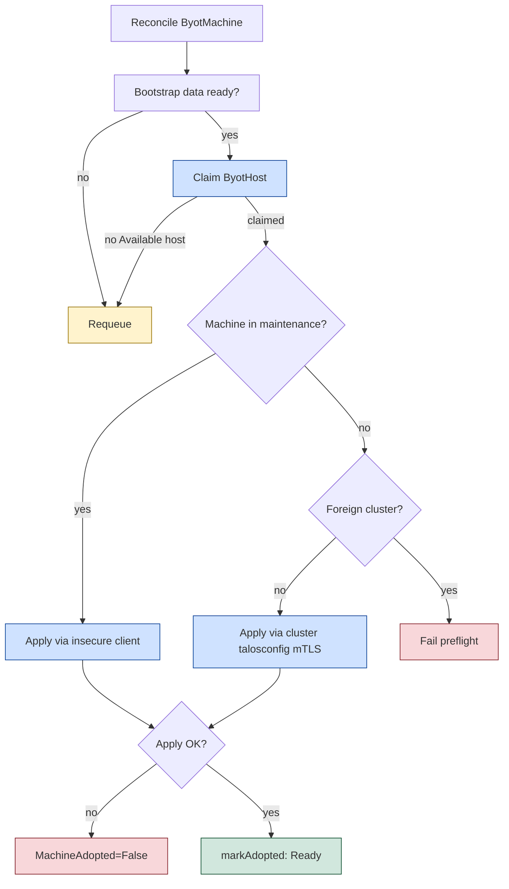

# cluster-api-provider-bringyourowntalos (byot)

> **⚠️ Work in progress.** This provider is under active development; breaking
> changes to its API and behavior will occur without notice.

Cluster API infrastructure provider that **adopts** existing Talos Linux
machines from a host registry and applies the cluster's bootstrap machine
configuration over the Talos machine API.

Hosts are manually-added `ByotHost` records (IP only) of Talos machines sitting
in **maintenance mode**, firewall-protected. The controller discovers each
host's hardware features and Talos version from the maintenance API and probes
liveness periodically, promoting a curated, low-cardinality, bucketed subset
to `byot.io/` labels so `ByotMachine` objects can claim hosts by capability
without operator label bookkeeping.

`ByotMachine` objects claim a `ByotHost` from the registry — explicitly via
`hostRef` or by `hostSelector` (label selector + `failureDomain`) — and adopt
the host at its public IP. Release always resets the host (STATE + EPHEMERAL)
back to maintenance so it returns to the registry for re-claim.

Two adoption modes for the claimed host:

- **Maintenance mode** (the registry path): the host is in maintenance, so the
  bootstrap config applies via unverified TLS (no host agent needed).
- **Already configured**: a foreign machine previously booted with some other
  machineconfig is taken over via mTLS using the machine's *current*
  talosconfig (`spec.talosConfigSecretRef`).

After adoption, byot keeps machines in sync: when the bootstrap data changes,
the new configuration is re-applied using the cluster's own talosconfig.

Inspired by
[BYOH](https://github.com/vmware-tanzu/cluster-api-provider-bringyourownhost)
(unmaintained), without a host agent: Talos already exposes everything needed.

Design decisions: see [docs/PRD.md](docs/PRD.md) and
[docs/PRD-host-registry.md](docs/PRD-host-registry.md).

## Usage

This provider is a library module: its controllers run in-process inside
[Kommodity](https://github.com/kommodity-io/kommodity). Enable it with
`KOMMODITY_INFRASTRUCTURE_PROVIDERS` including `byot`.

Operators add hosts manually as IP-only records; the controller discovers and
probes them:

```yaml
apiVersion: infrastructure.cluster.x-k8s.io/v1alpha1
kind: ByotHost
metadata:
  name: host-7
spec:
  publicIP: "203.0.113.10"
  failureDomain: "par01"
```

A `ByotMachine` claims a host explicitly or by selector:

```yaml
apiVersion: infrastructure.cluster.x-k8s.io/v1alpha1
kind: ByotMachine
metadata:
  name: worker-0
spec:
  # Explicit claim — one of hostRef / hostSelector is required:
  hostRef:
    name: host-7
  # Selector claim — list Available hosts matching labels + failureDomain:
  # hostSelector:
  #   matchLabels:
  #     byot.io/available: "true"
  #     byot.io/memory-class: "64G"
  # failureDomain: "par01"
  # Only for machines already configured elsewhere (foreign takeover):
  # talosConfigSecretRef:
  #   name: old-cluster-talosconfig
```

`hostRef` and `hostSelector` are mutually exclusive (CEL-validated). The
controller resolves the adoption IP from the claimed `ByotHost` into
`status.resolvedPublicIP`.

The controller:

1. Waits for the owning CAPI `Machine`'s bootstrap secret (generated by the
   Talos bootstrap provider, CABPT).
2. Claims a `ByotHost`: the host named by `hostRef`, or the first `Available`
   host matching `hostSelector` (+ `failureDomain`), via an optimistic
   compare-and-swap on `status.claimRef`. A host finalizer blocks deletion
   while claimed.
3. Runs the join preflight against the resolved IP: the machine is probed to
   determine whether it is in maintenance mode, already carries this cluster's
   PKI bundle, or carries a foreign bundle (in which case adoption fails with
   `JoinPreflight=False/BundleMismatch` instead of silently misconfiguring the
   machine).
4. Applies the machine configuration to `<resolvedPublicIP>:50000`:
   - machine in maintenance mode → unverified maintenance client
   - machine carrying this cluster's bundle → mTLS with the cluster's own
     `<cluster>-talosconfig` secret
   - later reconciles (config drift / upgrades) → mTLS with the cluster's own
     `<cluster>-talosconfig` secret
5. Sets `providerID` to `byot://<resolvedPublicIP>`, records
   `status.lastAppliedConfigSHA`, and reports ready.

### ByotHost discovery + liveness

The `ByotHost` controller drives each host through a phase state machine:
`Probing → Available ↔ Unavailable`, `Available → Claimed → Releasing →
Available`. It discovers features from the Talos maintenance API (`Version`,
`Memory`, `Disks`, `Dmesg` for CPU topology + platform, `LS /sys/class/net`
for interface names) and probes liveness (~60s), marking a host `Unavailable`
after consecutive failures and re-discovering on recovery. Discovery populates
a rich typed `status` (view-only) and promotes a curated, bucketed subset to
controller-managed `byot.io/` labels:

| Label                    | Source               | Values                                            |
| ------------------------ | -------------------- | ------------------------------------------------- |
| `byot.io/available`      | phase                | `"true"` only when `phase=Available`              |
| `byot.io/cpu-cores`      | `hardware.cpu.cores` | integer as string                                 |
| `byot.io/cpu-arch`       | `Version` arch       | `amd64` / `arm64`                                 |
| `byot.io/memory-class`   | `hardware.memory`    | `4G` / `8G` / `16G` / `32G` / `64G` / `128G`      |
| `byot.io/disk-type`      | system disk type     | `nvme` / `ssd` / `hdd` / `sd`                     |
| `byot.io/disk-class`     | system disk size     | `20G` / `100G` / `250G` / `500G` / `1T`          |
| `byot.io/platform`       | `platform`           | `scaleway`, `gefion`, ...                         |
| `byot.io/talos-version`  | `talosVersion`       | `v1.13.8`, ...                                    |
| `byot.io/failure-domain` | `spec.failureDomain` | operator-set physical FD, e.g. `par01`           |

A host is `Available` (claimable) only when maintenance-liveness is confirmed
**and** features are discovered. Operators may add their own freeform labels
(e.g. `site: gefion`); the controller never overwrites non-`byot.io/` labels.

### Release

Deleting a `ByotMachine` that has claimed a host always resets the host (STATE
+ EPHEMERAL) back to maintenance and flips the host to `Releasing`; the liveness
loop returns it to `Available` for re-claim. There is no "leave running" path
for claimed hosts: every release is a clean reset. A `ByotHost` deletion is
blocked by a finalizer while claimed — delete the owning `ByotMachine` first.

Disk encryption (network KMS against Kommodity) is configured in the Talos
machine configuration templates themselves; byot applies the configuration
untouched.

## Adoption flow



## Development

```sh
make generate  # deepcopy + CRDs
make build
make lint
make test
```

Requires Cluster API v1.10.x (`v1beta1` contract) and Talos machinery v1.13.x.
